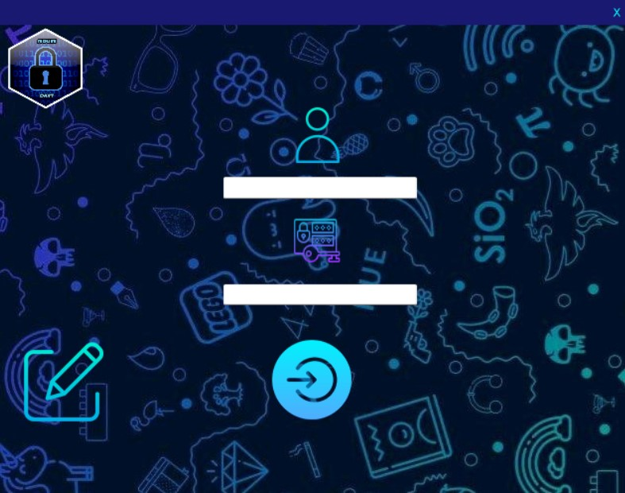
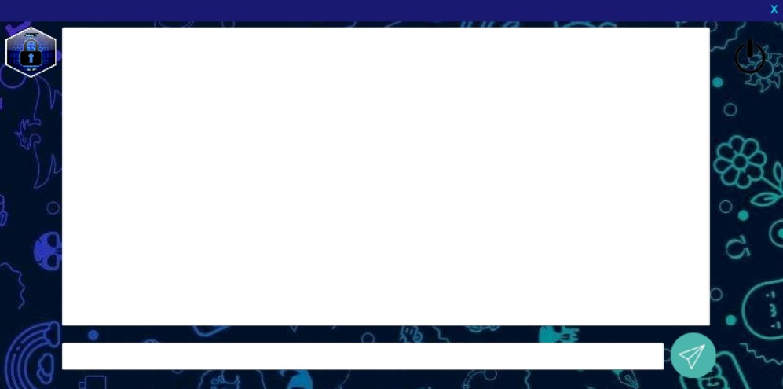
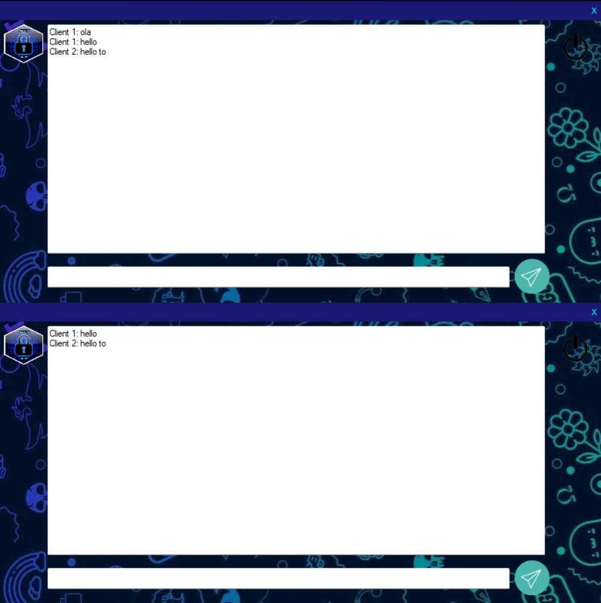
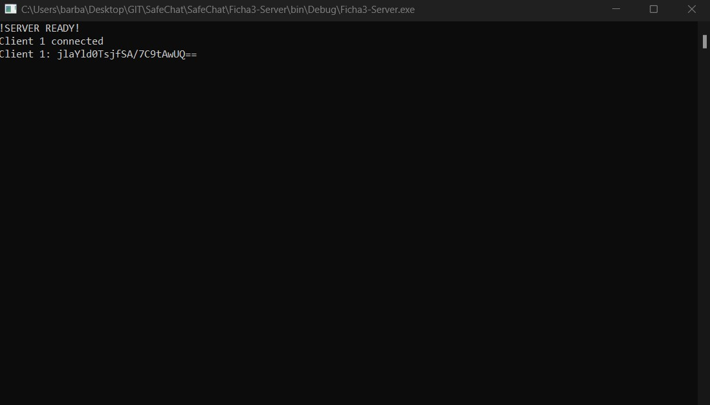

# Project SafeChat

### Description:

> This project consists of a chat where messages are delivered in real time and end-to-end encrypted.

> Tools Used:
>
> - [Visual Studio](https://visualstudio.microsoft.com/)
> - [C#](https://docs.microsoft.com/en-us/dotnet/csharp/)
> - [MySql](https://www.mysql.com/)
> - [ProtocolSI](https://www.cloudflare.com/learning/network-layer/what-is-a-protocol#:~:text=In%20networking%2C%20a%20protocol%20is%20a%%20wi)

## Development Mode

    git clone https://github.com/JoaoJesus1337/SafeChate.git

> Open the project in Visual Studio.

> The login Credencial are jj -> username and 123-> password for the cliente 1 and rodrigo -> username and 123-> password for the cliente 2.

## Login Page

## Chat Client1 Page

## Both Chats running

## Server with the encripted mensages

